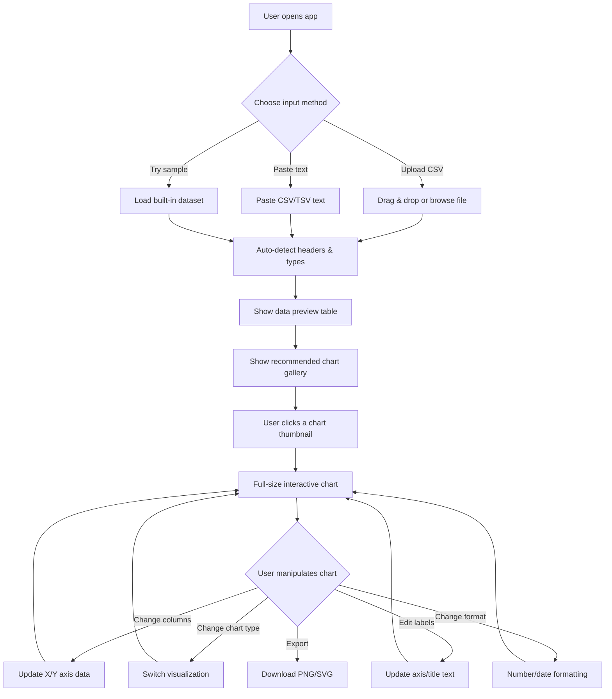

# Data Visualization Web App

Build a production-ready Python web application that allows users to upload CSV data or paste text data, then generates interactive charts for visualization — a fast alternative to Microsoft Excel charting.

## User Review Required

> [!IMPORTANT]
> **Tech Stack Decision**: The plan uses **FastAPI** (backend API) + **Jinja2 templates** with **Plotly.js** (frontend charts). This keeps everything in Python ecosystem per your workflow requirements. An alternative would be a React/Vite frontend, but that adds complexity. Please confirm this approach.

> [!IMPORTANT]
> **Chart Library**: Using **Plotly.js** for interactive charts (zoom, pan, hover, export). It handles all chart types natively and requires no additional JS build step. Alternative: Chart.js (lighter but less feature-rich). Please confirm.

> [!WARNING]
> **CLAUDE.md Architecture**: The existing CLAUDE.md describes a 3-layer `directives/execution/` architecture. This project will follow the `/create-new-python-app` workflow structure (`src/` + `tests/`) which is more appropriate for a standalone web app. The CLAUDE.md can be updated to reflect this project's structure.

## Open Questions

1. **Authentication**: Should users need to log in, or is this an open tool anyone can use locally?  
   *Assumption: No auth needed — local/internal tool.*

2. **Data Size Limits**: Any maximum file size for CSV uploads?  
   *Assumption: 50MB limit, configurable via config.*

3. **Persistence**: Should uploaded data and generated charts be saved to a database for later access?  
   *Assumption: Session-only storage (in-memory). No database needed for MVP.*

4. **Deployment**: Docker deployment or just local `uv run`?  
   *Assumption: Both — provide Dockerfile following your best practices.*

## Proposed Changes

### Project Structure

```
data-visualization-python/
├── src/
│   └── dataviz/
│       ├── __init__.py
│       ├── app.py                 # FastAPI application factory
│       ├── config.py              # App configuration (from .env + defaults)
│       ├── logger.py              # Modular logger (console + rotating file)
│       ├── routers/
│       │   ├── __init__.py
│       │   ├── pages.py           # HTML page routes (Jinja2 templates)
│       │   └── api.py             # REST API routes (data processing + chart generation)
│       ├── services/
│       │   ├── __init__.py
│       │   ├── data_parser.py     # CSV/text parsing, header detection, type inference
│       │   ├── chart_engine.py    # Chart recommendation + config generation
│       │   └── data_transformer.py # Column operations, formatting, aggregation
│       ├── models/
│       │   ├── __init__.py
│       │   └── schemas.py         # Pydantic models for API request/response
│       ├── static/
│       │   ├── css/
│       │   │   └── style.css      # Premium dark-mode UI styles
│       │   └── js/
│       │       ├── app.js         # Main application logic
│       │       ├── uploader.js    # File upload + text paste handler
│       │       ├── chart.js       # Plotly chart rendering + manipulation
│       │       └── controls.js    # Chart control panel (column picker, type switcher)
│       └── templates/
│           ├── base.html          # Base template with layout
│           └── index.html         # Main page template
├── tests/
│   ├── __init__.py
│   ├── conftest.py               # Shared fixtures
│   ├── test_data_parser.py       # Parser unit tests
│   ├── test_chart_engine.py      # Chart engine unit tests
│   ├── test_api.py               # API integration tests
│   └── test_data_transformer.py  # Transformer unit tests
├── pyproject.toml                # uv project config
├── Dockerfile                    # Multi-stage production build
├── .env.example                  # Environment variable template
├── .gitignore
└── README.md                     # Installation & usage guide
```

---

### Backend — Core Services

#### [NEW] [config.py](file:///Users/bob/dev/github/data-visualization-python/src/dataviz/config.py)
- Load settings from `.env` using `pydantic-settings`
- Settings: `APP_NAME`, `HOST`, `PORT`, `LOG_LEVEL`, `MAX_UPLOAD_SIZE_MB`, `ALLOWED_EXTENSIONS`
- Immutable singleton pattern

#### [NEW] [logger.py](file:///Users/bob/dev/github/data-visualization-python/src/dataviz/logger.py)
- Modular logger with **console handler** (colored output) + **rotating file handler** (10MB, 5 backups)
- `get_logger(name)` factory function
- Configurable log level from config

#### [NEW] [app.py](file:///Users/bob/dev/github/data-visualization-python/src/dataviz/app.py)
- FastAPI application factory
- Mount static files, configure Jinja2 templates
- Include routers
- CORS middleware, lifespan events

---

### Backend — Data Processing

#### [NEW] [data_parser.py](file:///Users/bob/dev/github/data-visualization-python/src/dataviz/services/data_parser.py)
**Core parsing logic:**
- Accept CSV file upload or raw text paste
- **Auto-detect headers** via heuristic: if first row has all strings while subsequent rows have mixed types → treat as header; otherwise generate `Column_1, Column_2, ...`
- **Delimiter detection**: auto-detect CSV delimiter (comma, tab, semicolon, pipe)
- **Type inference**: classify each column as `numeric`, `categorical`, `datetime`, or `text`
- **Data profiling**: generate summary stats (min, max, mean, unique count, null count) per column
- Return structured `DataProfile` with parsed DataFrame info

#### [NEW] [chart_engine.py](file:///Users/bob/dev/github/data-visualization-python/src/dataviz/services/chart_engine.py)
**Smart chart recommendation:**
- Based on column types and count, suggest appropriate chart types:
  - 1 numeric → Histogram, Box plot
  - 2 numeric → Scatter plot, Line chart
  - 1 categorical + 1 numeric → Bar chart, Pie chart
  - 1 datetime + 1 numeric → Time series line chart
  - Multiple numeric → Heatmap (correlation matrix), Parallel coordinates
  - 1 categorical + multiple numeric → Grouped bar chart
- Generate Plotly.js JSON configuration for each recommended chart
- Support user overrides (change X/Y axis, chart type, colors, labels)

#### [NEW] [data_transformer.py](file:///Users/bob/dev/github/data-visualization-python/src/dataviz/services/data_transformer.py)
- Column renaming
- Data type conversion (string → number, string → date)
- Aggregation (group by + sum/mean/count)
- Filtering and sorting
- Handle missing values (drop/fill)

---

### Backend — API Layer

#### [NEW] [api.py](file:///Users/bob/dev/github/data-visualization-python/src/dataviz/routers/api.py)
REST endpoints:
- `POST /api/upload` — Accept CSV file, parse, return data profile + recommended charts
- `POST /api/paste` — Accept raw text, parse, return data profile + recommended charts
- `POST /api/chart` — Generate specific chart config from user selections
- `POST /api/transform` — Apply data transformations (rename, reformat, aggregate)
- `GET /api/sample-data` — Return built-in sample datasets for quick demo

#### [NEW] [pages.py](file:///Users/bob/dev/github/data-visualization-python/src/dataviz/routers/pages.py)
- `GET /` — Serve the main index page

#### [NEW] [schemas.py](file:///Users/bob/dev/github/data-visualization-python/src/dataviz/models/schemas.py)
Pydantic models:
- `DataProfile` — Column info, types, stats
- `ChartRequest` — chart type, x/y columns, options
- `ChartResponse` — Plotly.js JSON config
- `TransformRequest` — transformation operations

---

### Frontend — Premium UI

#### [NEW] [style.css](file:///Users/bob/dev/github/data-visualization-python/src/dataviz/static/css/style.css)
- **Dark mode** with glassmorphism panels
- Smooth gradient backgrounds (deep navy → purple)
- Modern typography (Inter font from Google Fonts)
- Responsive grid layout
- Micro-animations: fade-in, slide-up, hover glow effects
- Drag-and-drop upload zone with animated border
- Chart card grid with hover elevation

#### [NEW] [index.html](file:///Users/bob/dev/github/data-visualization-python/src/dataviz/templates/index.html)
Main page layout:
1. **Hero header** — App name + tagline
2. **Upload zone** — Drag & drop file area + text paste tab + "Try sample data" button
3. **Data preview** — Scrollable table showing parsed data with editable headers
4. **Chart gallery** — Grid of recommended chart thumbnails (click to expand)
5. **Chart workspace** — Full-size interactive Plotly chart with control panel
6. **Control panel sidebar** — Column selector dropdowns, chart type switcher, color picker, axis labels, data format options

#### [NEW] [app.js](file:///Users/bob/dev/github/data-visualization-python/src/dataviz/static/js/app.js)
- Main controller: coordinates upload → parse → chart flow
- State management for current data session

#### [NEW] [uploader.js](file:///Users/bob/dev/github/data-visualization-python/src/dataviz/static/js/uploader.js)
- Drag & drop file handling
- Text paste handling  
- "Has header row" toggle
- File validation (CSV only, size check)
- Loading animation during upload

#### [NEW] [chart.js](file:///Users/bob/dev/github/data-visualization-python/src/dataviz/static/js/chart.js)
- Render Plotly.js charts from API response
- Chart resize handling
- Export chart as PNG/SVG
- Chart gallery thumbnail rendering

#### [NEW] [controls.js](file:///Users/bob/dev/github/data-visualization-python/src/dataviz/static/js/controls.js)
- Dynamic column selector (populated from data profile)
- Chart type switcher with icon previews
- Axis label editing
- Number format selector
- Color theme picker
- Real-time chart updates on control changes

---

### Testing

#### [NEW] [test_data_parser.py](file:///Users/bob/dev/github/data-visualization-python/tests/test_data_parser.py)
- Test CSV parsing with/without headers
- Test delimiter detection (comma, tab, semicolon)
- Test type inference (numeric, categorical, datetime)
- Test data profiling accuracy
- Test edge cases (empty file, single column, single row)

#### [NEW] [test_chart_engine.py](file:///Users/bob/dev/github/data-visualization-python/tests/test_chart_engine.py)
- Test chart recommendations for different column type combinations
- Test Plotly config generation
- Test user override application

#### [NEW] [test_api.py](file:///Users/bob/dev/github/data-visualization-python/tests/test_api.py)
- Integration tests using FastAPI TestClient
- Test file upload endpoint
- Test text paste endpoint
- Test chart generation endpoint
- Test error handling (invalid file, empty data)

#### [NEW] [test_data_transformer.py](file:///Users/bob/dev/github/data-visualization-python/tests/test_data_transformer.py)
- Test column renaming
- Test type conversion
- Test aggregation operations

---

### Infrastructure

#### [NEW] [Dockerfile](file:///Users/bob/dev/github/data-visualization-python/Dockerfile)
Following user's Docker best practices:
- Multi-stage build (builder + runtime)
- Non-root user
- Proper layer ordering (deps before code)
- `--no-cache-dir` in pip
- Precompiled bytecode
- Explicit labels

#### [NEW] [.env.example](file:///Users/bob/dev/github/data-visualization-python/.env.example)
- Template with all config vars and descriptions
- No actual secrets

#### [NEW] [README.md](file:///Users/bob/dev/github/data-visualization-python/README.md)
- Project background & features
- Screenshots placeholder
- Installation with `uv`
- Running locally
- Running with Docker
- Running tests
- Architecture overview

---

## User Flow



## Dependencies

| Package | Purpose |
|---------|---------|
| `fastapi` | Web framework |
| `uvicorn` | ASGI server |
| `python-multipart` | File upload support |
| `jinja2` | HTML templating |
| `pandas` | Data parsing & manipulation |
| `pydantic-settings` | Config management |
| `python-dotenv` | .env file loading |
| `httpx` | Async test client |
| `pytest` | Testing framework |
| `pytest-asyncio` | Async test support |

Frontend (CDN, no build step):
- **Plotly.js** — Interactive charts
- **Inter font** — Modern typography

## Verification Plan

### Automated Tests
```bash
uv run pytest tests/ -v
```
- Unit tests for data parsing, chart engine, transformations
- Integration tests for API endpoints using FastAPI TestClient

### Manual Verification
- Start the dev server with `uv run uvicorn src.dataviz.app:app --reload`
- Test file upload with various CSV files
- Test text paste with tab/comma/semicolon delimited data
- Test header auto-detection
- Test all chart types render correctly
- Test chart manipulation controls
- Verify responsive layout on different screen sizes
- Verify the browser recording via browser subagent
